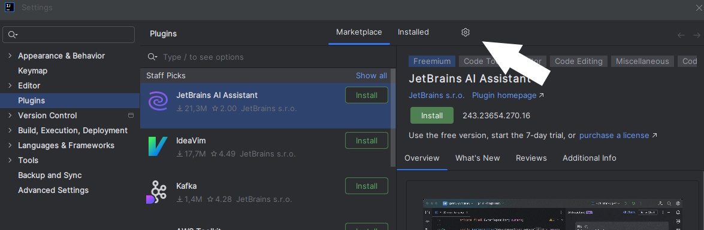
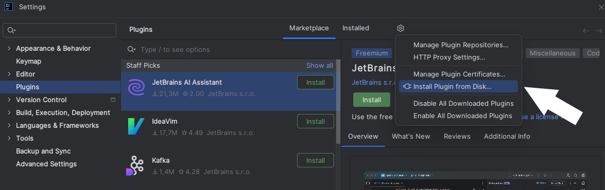

## Installation
### Requirements
- [IntelliJ IDEA 2025.3 or later](https://www.jetbrains.com/idea/download/other/#releases-2025)
### How to
- Download the [last version of the plugin](https://github.com/Dzenali/Plugin/tags)
- Open IntelliJ and open ``File -> Settings -> Plugins``
- Click on the gear icon 

- Click on "Install Plugin From Disk"

- Select plugin zip file
- Restart IDE

## Playing
### Running Pitest
To check whether your tests kill mutants, you can run the command in your terminal on IJ:
mvn test-compile org.pitest:pitest-maven:mutationCoverage
### Coverage achievements
To make Coverage Achievement works, it is required to go to:
class to test -> run tests -> run with coverage

